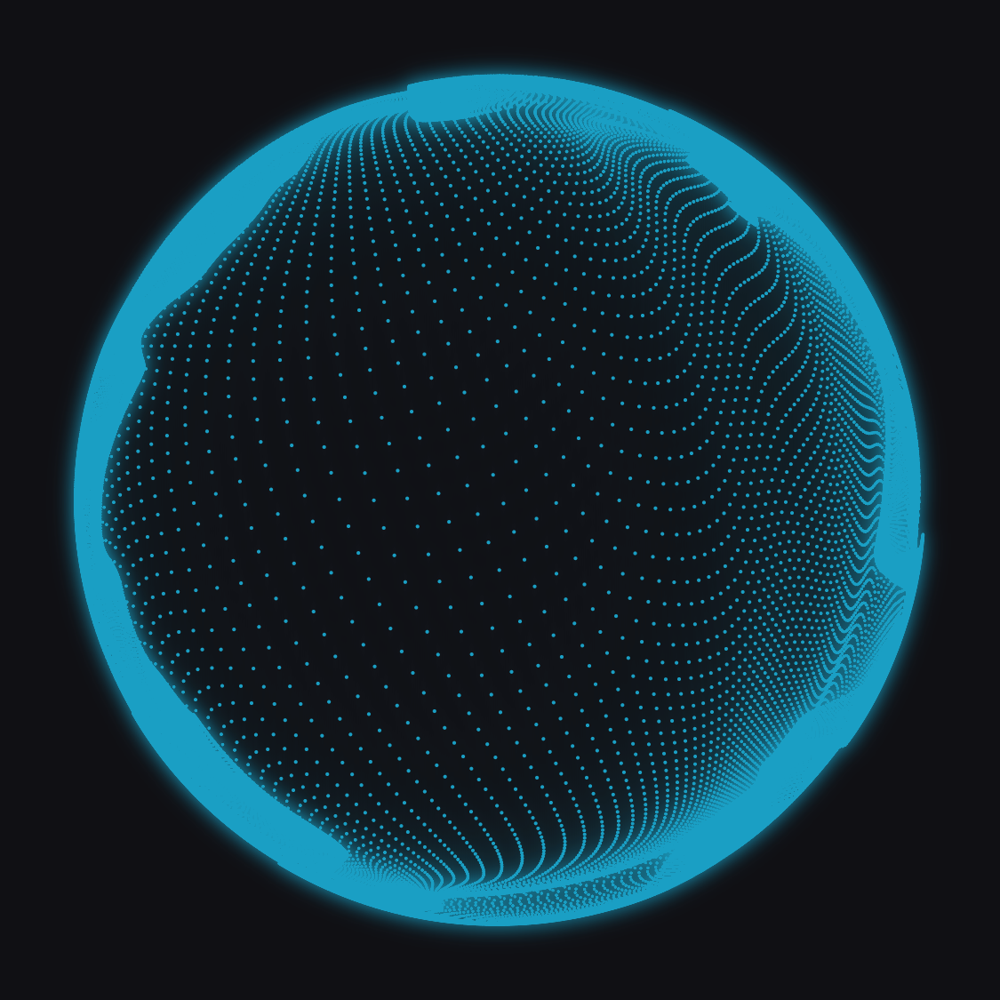

# Aurora NCS Visualizer

The NCS visualizer from [spicetify-visualizer][upstream] as a KDE Plasma 6
widget, driven by whatever your speakers are playing instead of by Spotify.

All 322×322 = **103,684 dots** are drawn every frame, entirely on the GPU.



## What is actually the original, and what is not

This is a port, not a lookalike. Being precise about that matters both for
credit and for anyone maintaining it later.

| Part | Status |
| --- | --- |
| `particle` / `dot` / `blur` / `finalize` GLSL | **Verbatim** from upstream, mechanically extracted (see [Regenerating the shaders](#regenerating-the-shaders)) |
| Four-pass pipeline, `GL_MAX` blending, RG32F position texture, instanced dot splatting | **Verbatim** in structure |
| Constants: `dotRadius = 0.9 / dotCount`, `blurRadius = 0.01 × viewport`, `sphereRadius = mapLinear(amp, 0, 1, 0.675, 0.9)`, `feather = (amp+3)² × 45/1568` | **Verbatim** |
| Motion (`uAmplitude`, `uNoiseOffset`) | **Adapted** — see below |
| Colour | **Adapted** — see below |
| `finalize` fragment shader | Upstream's `max(blurred, original)`, plus an optional second tint that collapses to upstream's exact output when the two colours are linked (the default) |

Two things upstream gets from the Spotify API that simply do not exist for live
system audio:

- **Motion.** Upstream knows the track's whole loudness curve up front and
  computes

  ```js
  uAmplitude   = sampleAmplitudeMovingAverage(curve, t, 0.15)
  uNoiseOffset = (0.5 * t + integral(curve, t)) * 75 * 0.01
  ```

  so the amplitude is a plain 0.15 s moving average — **no spring, no beat
  detection** — and the noise advances at `0.75 × (0.5 + amplitude)`. The widget
  reproduces exactly that from CAVA's live loudness, using a *trailing* box
  filter since we cannot look ahead. This is the default,
  **Motion → Model → Original**.

  A second model is available (**Aurora**), taken from the Aurora player: a
  spring for the body of the motion plus a transient detector that punches on
  each beat. It reacts harder, but it is not what upstream does.

- **Colour.** Upstream tints from the album art's extracted colour. Here you
  choose: a fixed colour, the Plasma accent colour, or a slow hue cycle.

## Requirements

```sh
# Fedora / Nobara
sudo dnf install cava qt6-qtdeclarative-devel gcc-c++ cmake
```

- **cava** — the audio source (runtime).
- **qt6-qtdeclarative-devel**, **qt6-qtbase-devel**, **gcc-c++**, **cmake** —
  only needed to build the renderer plugin.
- **python3-websockets** and **qt6-qtwebsockets** — used by the CAVA fallback
  transport; usually already installed.

Needs a GPU with **OpenGL 3.3+**, and Qt Quick on its OpenGL RHI backend (the
default on Linux). The plugin reports a readable error on the sphere if either
is missing, rather than failing silently.

## Install

```sh
./install-plugin.sh   # builds the GPU renderer, installs it system-wide (sudo)
./install.sh          # installs the widget package for your user
systemctl --user restart plasma-plasmashell
```

Then right-click the desktop or a panel → **Add or Manage Widgets** → **Aurora
NCS Visualizer**.

> **The order matters.** Install the package *before* restarting plasmashell,
> and restart *before* adding the widget. If you add the widget while
> plasmashell still holds a stale package list, the load fails **and plasmashell
> then uninstalls the package**, deleting
> `~/.local/share/plasma/plasmoids/tausif.aurora.ncs.visualizer/`. If that
> happens: re-run `./install.sh`, restart, add it again.

To remove: `./uninstall.sh` (and delete the widget from the desktop).

### Installing from the archive instead

`./package.sh` produces two files:

- `aurora-ncs-visualizer-v<version>.plasmoid` — the QML side, installable via
  **Add Widgets → Install from local file**.
- `aurora-ncs-visualizer-v<version>-src.zip` — the whole project.

A `.plasmoid` can only carry QML, so the compiled renderer still has to be built
with `./install-plugin.sh`. Without it the widget shows *"GPU renderer plugin
not installed"*. If you install the `.plasmoid` through the GUI, also run:

```sh
chmod +x ~/.local/share/plasma/plasmoids/tausif.aurora.ncs.visualizer/contents/ui/tools/commandMonitor
```

because kpackagetool does not preserve the executable bit.

## Settings

| Page | Contents |
| --- | --- |
| **Appearance** | Colour source, sphere size, dots per side, dot size, glow radius, frame-rate cap, noise seed |
| **Motion** | Model (Original / Aurora), audio gain, averaging window, flow speed; for Aurora: stiffness, damping, loudness follow, punch, beat decay, onset threshold |
| **CAVA** | Capture device and method, bar count, cutoff frequencies, smoothing, sensitivity |
| **General** | Desktop background, panel sizing, auto-hide when idle, pause on fullscreen/maximised windows, debug readout |

See [Resource usage](#resource-usage) before leaving it running all day.

If it does not behave the way you want:

- Sphere barely moves → raise **Motion → Audio gain**. Stereo capture reads
  quieter than mono and wants more gain.
- Want it to hit harder on beats → **Motion → Model → Aurora**, raise **Punch**,
  lower **CAVA → Noise reduction**.
- Too twitchy → lengthen **Motion → Averaging window**.

**General → Debug mode** draws a live dot-count / frame-rate / level readout on
the sphere.

## How it works

```
CAVA ──stdout──> ProcessMonitor ──> Cava.qml ──> analyseBars() ──> level, bass
                                                                        │
                                                code/ncs.js  motion model
                                                                        │
                                                       amplitude, noiseOffset
                                                                        │
                                                                        v
                                  NcsOrb.qml ──> NcsSurface.qml ──> NcsVisualizer (C++)
                                                                        │
                                    particle → dot → blurX → blurY → finalize   (GPU)
```

- **`plugin/`** is a `QQuickFramebufferObject`. Each frame it renders the four
  passes into its own FBO with raw OpenGL, and Qt Quick composites that FBO like
  any other item. The QML side only updates two floats per frame — but driving a
  60 fps repaint is not free for the shell, see [Resource usage](#resource-usage).
- **`package/`** is an ordinary Plasma applet. `NcsOrb.qml` owns the motion model
  and a `FrameAnimation` decimated to the configured frame cap.
  `NcsSurface.qml` exists solely so `NcsOrb` can load the plugin through a
  `Loader` and show a friendly message if it is missing.
- **CAVA transport** prefers the C++ process plugin from
  [plasma-audio-visualizer][pav] if you happen to have it installed, and
  otherwise falls back to a Python WebSocket helper (`tools/commandMonitor`).
  The log line `module "com.github.luisbocanegra.audiovisualizer.process" is not
  installed` is that fallback working as intended.

### CAVA stereo layout

CAVA emits stereo as `[left reversed | right forward]`, so the two channels'
**low frequencies meet in the middle** of the bar array, not at index 0.
`analyseBars()` accounts for this when picking the bass band.

Verified empirically rather than assumed: correlating the two halves of the bar
array gives **r = +0.707** as-is and **r = +0.974** with the left half reversed,
and against a simultaneous mono capture the stereo bars tracking mono's bass best
were **14–17 of 32**.

CAVA also silently rounds the bar count **down to even** in stereo (asking for 31
gives you 30), so the widget rounds it for you.

## Development

### Regenerating the shaders

`plugin/shaders.h` is generated, never hand-edited. To re-sync with upstream:

```sh
git clone https://github.com/Konsl/spicetify-visualizer /tmp/spicetify-visualizer
python3 plugin/gen_shaders.py /tmp/spicetify-visualizer plugin/shaders.h
```

It extracts the GLSL from `src/shaders/ncs-visualizer/*.ts` and applies exactly
three edits, each of which fails loudly if upstream changes shape:

1. `#version 300 es` → `#version 330 core` (WebGL2 → desktop GL).
2. Drops `precision …;` lines — GLSL ES only, and Mesa's core profile rejects
   them.
3. Gives `GRADIENTS_3D` an explicit size, and patches `finalize.ts` to add the
   optional `uGlowColor` tint. That patch asserts on the exact upstream body, so
   an upstream change raises `finalize.ts no longer matches the expected body`
   rather than silently producing something wrong.

### Rebuild and reinstall

```sh
./install-plugin.sh && ./install.sh && systemctl --user restart plasma-plasmashell
```

### Testing without Plasma

```sh
qml tools/preview.qml                        # renderer only, prints shader errors
plasmawindowed tausif.aurora.ncs.visualizer  # the whole widget in a window
qmllint -I /usr/lib64/qt6/qml package/contents/ui/*.qml package/contents/ui/components/*.qml
```

`qml tools/preview.qml` is the fastest loop when touching the shaders — it takes
Plasma and CAVA out of the picture entirely.

### Logs

```sh
journalctl --user -t plasmashell -f | grep tausif.aurora.ncs
```

Enable **General → Debug mode** to raise the log level.

## Resource usage

Measured on an Intel Iris Xe (Alder Lake GT2, Mesa 26.2), Plasma 6.7 on Wayland,
widget floating on the desktop at 400x400 with the default 322x322 dots at
60 fps. Baseline is the same session with the widget stopped.

| | Baseline | Widget running | Cost |
| --- | --- | --- | --- |
| `plasmashell` CPU | 9.9 % | 33.5 – 42.1 % | **+24 to +32 %** of one core |
| `cava` CPU | — | 3.1 % | +3 % |
| `commandMonitor` CPU (Python bridge) | — | 2.0 % | +2 % |
| GPU Render/3D busy | 39.4 % | 60.5 % | **+21 pp** |
| GPU power | 1.94 W | 6.66 W | **+4.7 W** |
| GPU clock | 610 MHz | 1091 MHz | +481 MHz |
| RAM | — | — | **~45 MB** (≈7 MB in plasmashell, 10 MB cava, 28 MB bridge) |

So roughly **a third of one CPU core and ~5 W of GPU** on this hardware. That is
not a background trinket — it is a 60 fps full-redraw of a desktop widget, and
the CPU goes on the shell's render loop and the GL submit path rather than on
the dots themselves (all 103,684 of those are on the GPU).

Ways to bring it down, most effective first:

- **Lower the frame cap.** Appearance → Frame rate limit. At 30 fps the GPU cost
  roughly halves (+2.5 W instead of +4.7 W).
- **Leave "pause on fullscreen window" on** (the default) so it stops entirely
  during video and games.
- **Turn on auto-hide when idle** so it stops when nothing is playing.
- **Make the widget smaller.** Cost scales with pixel area, not dot count —
  dropping the dots per side barely helps, shrinking the sphere does.
- **Build the C++ CAVA process plugin** from
  [plasma-audio-visualizer][pav] to retire the Python bridge (~2 % of a core).

## Known issues

- Changing CAVA settings restarts the capture process.
  `ProcessMonitorFallback.restart()` (inherited from
  [plasma-audio-visualizer][pav]) returns early while a previous restart is still
  pending, which in principle can drop a restart. Not reproduced, but it is the
  first place to look if the sphere ever freezes after a settings change.
- Panel placement is implemented but only lightly tested; development was done
  floating on the desktop at 400–500 px.
- The `.plasmoid` cannot contain the renderer, so it is not a one-click install.

## Credits and licence

Copyright (C) 2026 Tausif Nazir

This program is free software: you can redistribute it and/or modify it under
the terms of the GNU General Public License as published by the Free Software
Foundation, either version 3 of the License, or (at your option) any later
version. See [LICENSE](LICENSE).

It is a derivative work; the licence is inherited from both upstreams, which are
also GPL-3.0.

| Source | What came from it |
| --- | --- |
| [spicetify-visualizer][upstream] by **Konsl** | The visualizer itself: all four shaders, the render pipeline, and every constant in it. `plugin/shaders.h` is generated from that repo. |
| [plasma-audio-visualizer][pav] by **Luis Bocanegra** | The CAVA plumbing: `Cava.qml`, `ProcessMonitor*.qml`, `RunCommand.qml`, `PactlList.qml`, `ColorButton.qml`, `Logger.qml`, `TasksModel.qml`, `tools/commandMonitor`, and the applet skeleton. |
| The Aurora player | The alternative spring + beat-punch motion model. |
| [CAVA][cava] by **Karl Stavestrand** | The audio capture and FFT that drives all of it. |

If you publish this, keep those attributions and the GPL-3.0 licence intact, and
consider opening an issue on the upstream projects to let them know — they are
doing the hard part here.

[upstream]: https://github.com/Konsl/spicetify-visualizer
[pav]: https://github.com/luisbocanegra/plasma-audio-visualizer
[cava]: https://github.com/karlstav/cava
